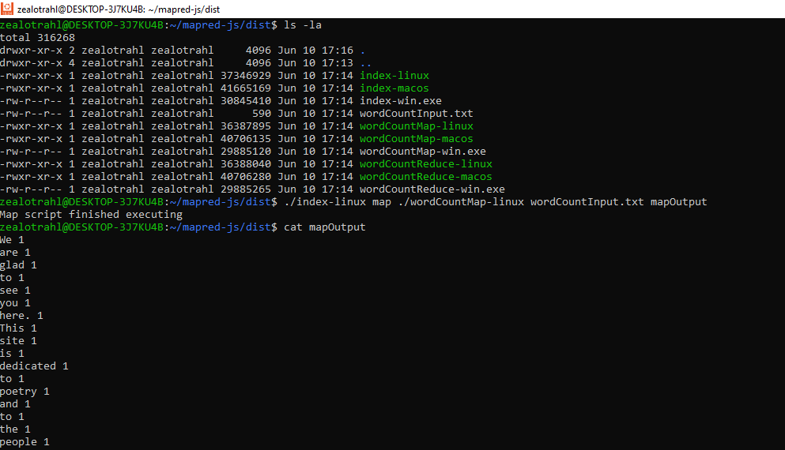
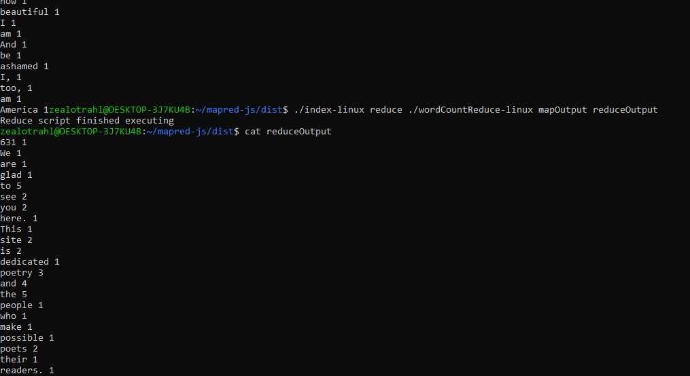

This repository contains the implementation of a primitive Map-Reduce programming paradigm using JavaScript. It serves as the homework assignment for EPIC Real-Time Backend.

```
Running an app looks ~ like this:

./mapreduce map "path_to_map_script" src_file dst_file

./mapreduce reduce "path_to_reduce_script" src_file dst_file
```

### Usage

To execute the map operation, run the following command:

`node .\index.js map wordCountMap.js ./wordCountInput.txt asd`

To execute the reduce operation, run the following command:

`node .\index.js reduce wordCountReduce.js asd daf`

### Binary Distribution

The **dist** folder contains the binary version of the code. Compilation was done using [pkg](https://github.com/vercel/pkg).

The change required for the binary distribution is as follows:

```javascript
exec(`node ${pathToScript}`, (error, stdout, stderr) => {
```

should be replaced with:

```javascript
execFile(pathToScript, (error, stdout, stderr) => {
```

Also uncomment validation for checking if file is executable

```
if (!fs.existsSync(pathToScript) || !(fs.statSync(pathToScript).mode & fs.constants.S_IXUSR)) {
  console.error("Script does not exists or is not executable");
  return;
}
```





### Future improvements

The code in this repository is relatively simple. However, to fully leverage the benefits of the Map-Reduce paradigm, it is recommended to enhance the code using Node.js cluster mode. This allows for running mappers and reducers in parallel, resulting in improved performance.
